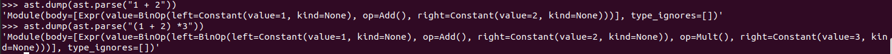

# 문법이란? 
프로그래밍 언어에는 여러 가지 규칙이 있다. 예를 들면 덧셈 보다는 곱셈이 우선순위가 높다. 문법이란 프로그래밍 언어 설계자가 만든 이렇게 쓰면 이런 의미로 해석된다 라고 정한 규칙이다.
앞서 프로그래밍 언어가 사람을 편하게 하기 위해 만들어졌다고 하였다. 그렇다면 문법이란 무엇을 편하게 하기 위해 만들어졌을까??  

### 연산자 우선순위
우리가 사용하고 있는 언어에서는 분명 덧셈과 곱셈을 `1+2*3` 이라 표현하고 있다. 
연산자란 덧셈에 사용하는 `+` 나 곱셈에 사용하는 `*`을 의미한다.  
그렇다면 `1+2*3`이라는 소스 코드가 있다면 이것이 1에 2를 더해서 그 결과에 3을 곱하는 것 즉 `(1+2)*3`인지 아니면 2와 3을 곱해서 그 결과에 1을 더한것 
`1+(2*3)`인지 도대체 어딴 규칙이 적용되는 것일까??  
그것은 사람이 편한 쪽으로 정하고 있다. 예를 들어 옜날 계산기 중에는 `1+2*3`의 결과가 9가 되는 것이 있었다. 하지만 지금 우리가 사용하고 있는 프로그래밍 언어의 대부분의 계산 결과는 7이된다. 
이는 프로그래밍 설계자가 `+` 보다는 `*` 에 우선순위가 높기 때문에 먼저 계산한다는 규칙을 정했기 때문이다. 그렇게 해야 사칙연산과 같아서 이해하기가 쉬워진다.  
또한 나눗셈을 사용해 `9/3/3` 이라 작성할 경우 이것이 `9/(3/3)`인지 `(9/3)/3` 인지 어떤식으로 정해져 있을까?
이것 또한 대부분의 언어에서는 `(9/3)/3`으로 계산한다. 이또한 프로그래밍 설계자가 `/` 은 좌결합성 연산자 이기 때문에 나열되어 있는 순서대로 먼저 계산한다는 규칙을 정했기 때문이다.

### 문법은 언어 설계자가 정한 규칙 
운어 설계자가 정한 규칙이 바로 문법이다. 문법은 언어에 따라 다르다.
연산자의 종류도 언어에 따라 다르다 예를 들어 C언어 에서는 `=` 가 연산자이며 일반적인 가감승제와 다르게 우결합성 연산자이다. 그래서 소스코드에 
`x=y=1`이라고 써 있다면 이것은 `x=(y=1)`이라 해석된다. 

# 스택 머신과 FORTH
FORTH 은 1958년에 개발되어 문법이 거의 존재하지 않는 언어이다.  
설계자인 [Charles H. Moore](https://en.wikipedia.org/wiki/Charles_H._Moore) 에 따르면 FORTH 는 가장 간단한 컴퓨터 언어이다.   
세상의 모든 언어가 가독성이 있다고 주장하고 있지만 처음 그 언어를 다루는 사람은 항상 당황한다. 이는 난해한 문법 때문이다.   
FORTH 는 구문을 최대한 제한함으로써 문제를 해결한다 는 것이 그의 주장이다.

### 계산 순서 
그럼 문법이 거의 없는 FORTH 에서는 어떻게 코드를 쓰고 있을까?  
FORTH 에서는 1과 2를 더한다는 코드는 아래와 같다.  
```bash
1 2 +
```
FORTH 의 가장 큰 특징인 스택(stack)즉 즉 값을 쌓아두는 장소를 사용한다.   

주로 위가 열려있는 상자로 표현한다. 소스 코드를 위에서 부터 실행한다고 하면,  

1. 1이라는 워드와 만나고, 스택에 1을 담아둔다.
2. 2라는 워드와 만나 2라는 값을 스택에 담아둔다.
3. 마지막으로 + 라는 워드와 만난다. 

이 `+` 라는 워드는 스택에서 두 개를 꺼내서 그것을 더한 결과를 스택에 담아 라고 하는 명령과 연결되어있다. 그래스 스택에서 1과 2를 꺼내어 더한 결과인 3을 스택에 담는다.

### 연산 순서를 어떻게 표현할까??
그럼 이런 언어에서는 1에 를 더하고 그 결과에 3을 곱하는 것 즉 `(1+2)*3` 과 2와 3을 곱해서 그 결과에 1을 더하는것 `1 + (2*3)`은 어떻게 구별할 수 있을까?

1과 2를 더한 것에 3을 곱한다
```bash
1 2 + 3 *
```

2와 3을 곱한 후에 1을 더한다
```bash
2 3 * 1 +
```

거의 한국어 어순 그대로 이다. 만약 1,2, 3 의 순서가 중요하다면 다음과 같이 쓸 수도 있다.

```bash
1 2 3 * +
```
1과 (2와 3을 곱한 것을)더한다 이다. 한국어로는 순서상 오류를 피하기 위해 어디까지가 한 구역인지 관호를 사용하지만, FORTH에서는 괄호도 우선순위라는 규칙도 도입하지 않고 표현하고 있다.

### 현재도 현역인 스택머신
최근에 와선 FORTH 와 같이 스택 기반의 언어를 직접 입력하는 경우는 많이 줄었을 것이다. 그러나 사실 보이지 않는 곳에서 사용디고 있다.  
예를 들면 java, Python, Ruby 등은 스택 머신 형의 VM을 사용하고 있다. VM이 실행하는 명령렬도 FORTH 와 같은 구조로 되어 있다.  
Python 이나, Ruby, java 로 프로그램을 짜면 그 프로그램은 내부적으로 FORTH 와 같은 프로그램으로 변환되어 동작하고 있는 것이다.

python에 있는 dis 라이브러리를 사용해 vm이 실행할 명령렬을 출력해 볼 수 있다. 

1. (X+y) * z 라는 소스 코드가 x 를 스택에 담는다.
2. y를 스택에 담는다.
3. 스택의 상위 두개를 더한다
4. z를 스택에 담는다.
5. 스택에 있는 상위 2개를 곱한다. 
는 명령열로 컴파일 된다. 즉 앞서 이야기 했던. FORTH 와 동일하게  `xy+z*` 순으로 나열되어 있다.

# 구문 트리와 LISP
앞서 설명한 FORTH 코드늘 한국어로 표현하기 위해 어디까지가 한 구역인지 구분하기 위한 괄호를 사용했다.  
그런데 하나의 구역을 표현하기 위해 항상 괄호를 사용하자 는 선택을 한 언어가 있다. 1958년에 탄생한 LISP이다 

### 계산의 흐름
LISP 으로 1과 2를 더한다는 코드는 아래와 같이 표현한다.
```bash
(+ 1 2)
```
먼저 괄호로 시작해서 더해 라는 명령이 앞에 나온다. 그다음 공란으로 간격으로 만들고 무엇을 더할 것인지를 쓴다.
굳이 한국어로 표현하자면 다음과 간다. 더해 1과 2㔹

### 계산 순서를 어떻게 표현할까?
그럼 1과 2를 더한 후 3을 곱한다 는 코드는 어떻게 쓸까?
```bash
(* (+ 1 2) 3)
```
이 상황을 그림으로 표현해 보면 

1. 더해 1과 2를 의 부분이다. LISP 코드는 (+ 1 2 )이다. 그림에서는 최초 명령을 위에 그 다음 무언가를 아래에 쓰고 있다.
2. 곱해 무언거와 3을 이다. 무언가에 해당하는 부분을 ? 로 표현하고 있다.
3. 무언가 부분에 더해 1과 2를 사입하는 것이다. 
이렇게 표현하는 것을 구문 트리 라고 한다.

FORTH에서도 LISP에서도 구문 트리는 동일하다.
실은 단순한 무법으로 이루어진 이 두개의 언어는 특정 규칙을 사용해 구문 트리를 모방한 것 뿐이다.
즉 이 2가지 언어의 생김새는 크게 다르지만 동일한 구조를 사용해서 하고자 하는 것을 표현하고 있다.


### 현재도 살아 있는 구문 트리
구문 트리가 사용되고 있는 것은 최신 언어도 마찬가지이다. Python을 통해 살표혀자. 
Python에서는 ast 라이브러리를 사용하여 특정 코드가 어떤 구문 트리로 구성되어 있는지 알 수 있다 

이것을 LISP와 비교해보자. Python쪽이 약간 어지럽게 배열 되어 있지만, 공통된 구조를 찾아낼 수 있다.

LISP의 문법은 간단해서 코드와 구문이 알기 쉽게 연결된다. 또한 매크로 라는 구문 트리를 바꿔주는 메커니즘을 가지고 있어, 구조체 프로그래밍과 같은 프로그래밍 언어의 발전에 큰 기여를 하게 된다.

# 중위 표기법 
##### 후위 표기법
- FORTH
- 1 2 + 
##### 전위 표기법 
- LISP
- (+ 1 2)
##### 중위 표기법 
- 1 + 2

이 3가지 방법은 식을 표현하기 위한 약속에 불과하다. 하지만 프로그래밍 언어가 탄생하기 이전부터 사람들은 중위 표기법에 익숙했다.  
FORTRAN 이 이 익숙한 방법을 적용할 수 있도록 만들어 졌다. FORTRAN 이란 이름이 Fomular Translating System (수식 번역 시스템)의 약어인 이유도 이 때문이다.  
FORTRAN 은 연산자 우선순위나 결합성 등 다양한 규칙을 도입해 문법을 만들었다. 그 결과 프록래머는 익숙한 방법으로 수식을 사용할 수 있게 되었다.

### 구문 해석기 
구문 해석기(파서, Parse)는 소스 코드를 문자열로 읽어 들여 해석하고, 그것을 구문 트리로 만드는 프로그램이다. FORTRAN 에서 프로그램이 컴파일 될 때도 이 구문 해석기가 소스 코드를 문자열로 읽어 들여 
구문 트리로 변환하는 작업을 하고 있다.  
문법 설계와 구문 분석기 구현은 프로그래밍 언어의 와관을 결정하는 중요한 요소다. 언어 설계자는 문법을 설계할 때 무엇을 쉽게 쓸 수 있도록 할 것인지, 어떤 실수를 줄이도록 할 것인지 등 프로그래밍
언어가 사용자 에게 어떤 가치를 줄 수 있을지 생각한다.  

그러나 그렇게 고안한 문법이 구문 분석기로 구현될 수 있는지는 또 다른 문제이다. 구문 분석 방법에 따라서 어 떤 규칙을 적용해야 애매한 부분이 없이
분석할 수 있는지가 달라지게 된다. 또한 이미 만든 언어에 새로운 기능을 추가할 때는 기존 규칙과 맞지 않아 무제를 일으키는 경우도 있다.  

### 규칙간 마찰 
예를들어  C++ 에서는 템플릿 기능을 추가할 때 `vector<int>`와 같이 부등호로 감싸는 표기 를 도입했다. 그러나 이 부등식 괄호를 이중으로 하면 괄호를 닫는 `>>` 가 기존의 쉬프트 연산자로 해석되어 버린다.
이 문제를 구문 분석기가 해결하는 것이 쉽지 않아 프로그래머가 공백 문자를 사이에 입력해서 `>>` 가 되지 않도록 하는 즉 운영 측면에서 문제를 해결하도록 하였다. 
```C++
// ok
vector<vector<int> > x;
// ng
vector<vector<int>> y;
```
물론 구문 분석기가 양쪽 구문을 문제 없이 해석하도록 해건하는 것이 이상적이다. 그러나 현실은 이상과 다르다.
이것은 C++에 제한된 이야기가 아니며, 다른 언어에서도 과거 규칙과의 마찰로 인해 부자연 스러운 규칙이 생겨난 경우가 있다. 

# 정리 
1 더하기 2에 3을 곱한다 는 똑같은 처리도 어너에 따라 ㄷ표현 방법이 다양하다. 
그러나 구문 트리로 표현하면 거의 동일하다. 이들 언어에 차이가 생긴것은 어떤 문자열을 쓰면 어떤 구문 트리가 생기는가 라는 규칙이다.
이것이 문법이다.

FORTH나 LISP 는 규칙이 적은 것을 중시했다. 그러나 시장이 요구한 것은 규칙이 적거나 간단한 것이 아니었다.
FORTRAN 은 `*`가 `+` 보다 우선 순위가 높다. 등의 정해진 규칙을 대량으로 도입해서 다가가기 쉬운 작성법을 중시했다.
그리고 그런 설계 방침의 성공으로 FORTRAN 방식이 LISP 나 FORTH 보다 많은 사람에게 사랑 받게 되었다.

프로그램을 짤 때 왜 이렇게 다가가기 어려운 작성법이 필요한지 생각한 적이 있을 것이다. 현재 대부분의 프로그래밍 언어는 FORTRAN 식의 
다가가기 쉬운 작성법을 목표로 하고 있다. 하지만 모순 없이 해석할 수 있는 문법을 만들어 내는 것은 어려윤 작업이다. 
특히 나중에 새로운 문법을 추가할 때 기존 문법과 마찰되지 않도록 하는 것은 더욱 그렇다. 이 떄문에 현실의 프로그래밍 언어에는 이해하기
어려운 작성법이 여전히 존재하는 것이다.

# 사족 
구문트리라던가, 스택 방법이라던가, 아주 오래전 부터 사용해온 이 방법은 아직도 프로그래밍 레벨이 올라가면 당연히 알아야 하는 아주 중요한 개념이다.  
그리고 우리가 너무 당연히 이해하며 사용해왔던 아주 단순한 사칙연산과 같은 연산자의 활용도가 과거 어떠한 변화를 거쳐 지금까지 발전해 왔는지를 알 수 있는 좋은 기회가 아닐까 생각한다.  
역시 가장 기본적인 개념을 알아두는 것은 중요한 것 같다. 
